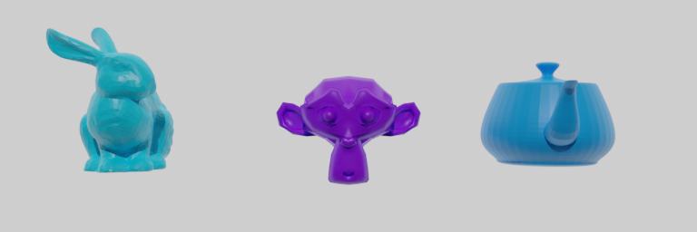
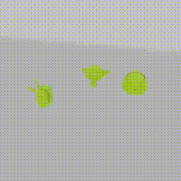
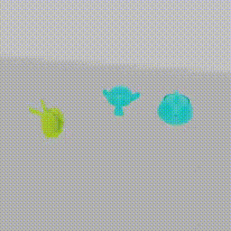

# CoNeRF synthetic dataset
[](https://github.com/kacperkan/conerf-kubric-dataset/blob/main/LICENSE)



This is the official implementation of code producing a synthetic dataset used in ["CoNeRF: Controllable Neural Radiance Fields"](https://github.com/kacperkan/conerf). The code uses [Kubric](https://github.com/google-research/kubric) to generate the dataset.


## Setup
In general, you do not need to install any Python version to run this code. The only requirement is [docker](https://www.docker.com/). Please, follow instructions provided [here](https://docs.docker.com/engine/install/) to install docker.


## Generation
Once set with docker, the generation pipeline is as easy as:
```bash
./render.sh
```

We additionally provided a script that generates a top-down view with a fixed camera setting. We have used that dataset in earlier versions of [our paper](https://arxiv.org/abs/2112.01983) but did not include it in the camera-ready version due to space constraints. The dataset was useful to validate CoNeRF for 2D case, without ray sampling as in traditional NeRF.

To generate the top-down dataset, please run:
```bash
./render_top.sh
```

The dataset then can be processed with [prepare_kubric_dataset.py](https://github.com/kacperkan/conerf/blob/main/prepare_kubric_dataset.py) in the original repo to canonicalize representation (*e.g.*, blender uses different axis setting than [JaxNeRF](https://github.com/google-research/google-research/tree/master/jaxnerf) that we have used to implement CoNeRF):

```bash
python prepare_kubric_dataset.py \
    <input-directory> \       # input directory generated from the scripts
    <output-directory> \      # where to put processed dataset
    [--use_all_annotations] \ # whether include all frames as being "annotated"; we used that for the validation part
    [--annotations <float>]   # percentage of samples to be marked as annotated; we used that for the training part
```

Example usage:
```bash
python prepare_kubric_dataset.py \
    output_train \
    ../conerf/captures/ \
    --annotations 0.05  
```

## Samples
The scripts above generate several files and standard output for Kubric. These files include:
```
output[_train|_valid]/
    ├── rgba_*.png                          # RGBA rendered images
    ├── [bunny|suzanne|teapot].npy          # object coordinates in the scene
    ├── [bunny|suzanne|teampot]_time.npy    # time between [0, 1] describing the interpolation between extreme values of controllable attributes (colors)
    ├── camera.npy                          # main camera matrix 
    ├── camera_time.npy                     # time between [0, 1] describing the interpolation of camera on the movement trajectory
    ├── fake_camera.npy                     # additional camera used to perform nice orbital visualization
    ...                                     # additional files
    ├── backward_flow_*.png                 # backward in time dense flow map
    ├── depth_*.tiff                        # depth images
    ├── forward_flow_*.png                  # forward in time dense flow map
    ├── normal_*.png                        # normal maps 
    ├── object_coordinates_*.png            # local object surface coordinates 
    ├── segmentation_*.png                  # segmentation maps for objects
    └── uv_*.png                            # UV maps
```

**Note:** The validation dataset uses a slightly shifted camera relative to the training set. This allowed us to perform novel view synthesis experiments.

<div style="text-align: center">
    <div style="width: 49%; display: inline-block;">
        <p>Train sequence</p>
        
    </div>
    <div style="width: 49%; display: inline-block;">
        <p>Validation sequence</p>
        
    </div>
</div>


## Citing
If you find our work useful, please consider citing:
```BibTeX
@inproceedings{kania2022conerf,
  title     = {{CoNeRF: Controllable Neural Radiance Fields}},
  author    = {Kania, Kacper and Yi, Kwang Moo and Kowalski, Marek and Trzci{\'n}ski, Tomasz and Tagliasacchi, Andrea},
  booktitle   = {Proceedings of the IEEE Conference on Computer Vision and Pattern Recognition},
  year      = {2022}
}
```
